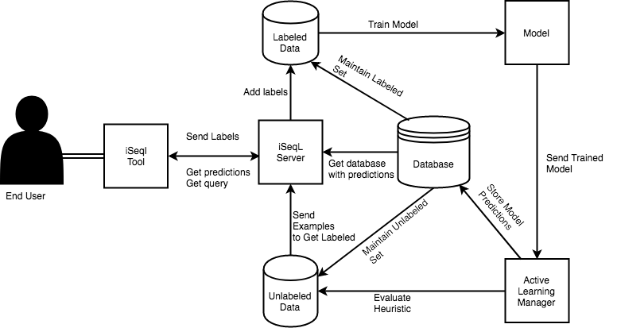

# iSeqL Server

This folder contains the code for the Active Learning Server for `iSeqL`. The archiecture and file layout are defined below:

## Architecture

## File Structure

### Server Running

These are files that contain the code for the actual server being run. The server run is relies on Flask. `iSeqL` needs to run expensive machine learning operations on a large server, the following files allow for the system to run in parallel and manage many concurrent users connecting to a single host.

* `server.py`: contains the `REST` API definition of the `iSeqL` server, and is responsible for starting up the main process.
* `server_manager.py`: handles the concept of various users connecting to the server at once, responsible for handling data loading, file IO, and creating active learning manager for each users session.
* `progress_thread.py`: creates a thread capable of providing progress reports as expensive operations occur. This allows things such as a progress bar to convey accurate information for each user.
* `thread_manager.py`: maintains a list of activate threads being run on the server, maintains them, and checks for progress.
* `distributed_server.py`: prototype of a RPC handler responsible for training the NER models (most expensive part of `iSeqL`), so that `iSeqL` could leverage a cluster of machines instead of a single one

### Data Handling

These are the files responsible for handling any data: model data, user data, labels, system stats etc.

* `database_manager.py`: Manages the datasets for each user / session, responsible for loading files into memory and writing them on to disk when done.
* `firebase_manager.py`: When doing an analysis of `iSeqL`, such as the one done in our Amazon Mechanical Turk Study, this is the module responsible for reporting all the user interaction and stats to a cloud database (firebase).

### Active Learning

Core files for machine learning and active learning being deployed in `iSeqL`, heavily reliant on the NER library written.

* `active_learning_manager.py`: The core active learning and model training component of `iSeqL`, this leverages the server components to fully parallelize and efficently train models in low resource settings using the NER library.

### Utility Files

* `constants.py`: various constants used throughout the codebase
* `utils.py`: utilty functions that are used throughout the codebase

## Configurations

More detail can be found in the `iseql_server/configurations/README.md` file

* `configurations/configuration_data/*.json`: This contains various `iSeqL` configurations for different datasets and active learning managers, showing how we ran the Case studies and the mechanical turk study.
* `configurations/configuration.py`: This parses the `.json` configuration files into dictionaries and allow's for concepts like inheritance of configurations and default values, so users do not have to specify every detail in the config.